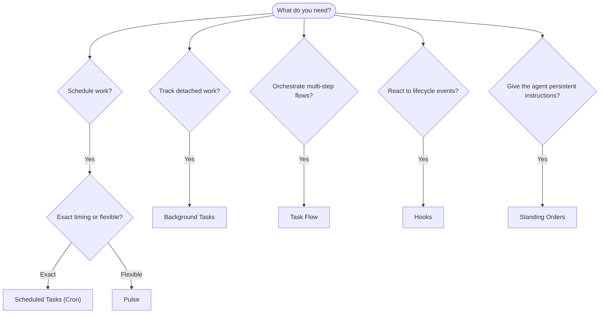

Kova runs work in the background through tasks, scheduled jobs, event hooks, and standing instructions. This page helps you choose the right mechanism and understand how they fit together.

## Product spine

Automation is one stack, not several unrelated schedulers:

- **Hooks** react to lifecycle events.
- **Cron** starts work at an exact time or from an inbound trigger.
- **Standing orders** define long-running authority and boundaries.
- **Task Flow** coordinates durable multi-step workflows.
- **Background tasks** record detached execution, delivery, and audit state.
- **Pulse** runs periodic main-session awareness checks when exact timing is
  less important than context.

Goals and higher-level commands should map onto this stack instead of creating
a parallel automation model.

## Quick decision guide

| Use case                                | Recommended            | Why                                          |
| --------------------------------------- | ---------------------- | -------------------------------------------- |
| Send daily report at 9 AM sharp         | Scheduled Tasks (Cron) | Exact timing, isolated execution             |
| Remind me in 20 minutes                 | Scheduled Tasks (Cron) | One-shot with precise timing (`--at`)        |
| Run weekly deep analysis                | Scheduled Tasks (Cron) | Standalone task, can use different model     |
| Check inbox every 30 min                | Pulse                  | Batches with other checks, context-aware     |
| Monitor calendar for upcoming events    | Pulse                  | Natural fit for periodic awareness           |
| Inspect status of a subagent or ACP run | Background Tasks       | Tasks ledger tracks all detached work        |
| Audit what ran and when                 | Background Tasks       | `kova tasks list` and `kova tasks audit`     |
| Multi-step research then summarize      | Task Flow              | Durable orchestration with revision tracking |
| Run a script on session reset           | Hooks                  | Event-driven, fires on lifecycle events      |
| Execute code on every tool call         | Plugin hooks           | In-process hooks can intercept tool calls    |
| Always check compliance before replying | Standing Orders        | Injected into every session automatically    |

### Scheduled Tasks (Cron) vs Pulse

| Dimension       | Scheduled Tasks (Cron)              | Pulse                                 |
| --------------- | ----------------------------------- | ------------------------------------- |
| Timing          | Exact (cron expressions, one-shot)  | Approximate (default every 30 min)    |
| Session context | Fresh (isolated) or shared          | Full main-session context             |
| Task records    | Always created                      | Never created                         |
| Delivery        | Channel, webhook, or silent         | Inline in main session                |
| Best for        | Reports, reminders, background jobs | Inbox checks, calendar, notifications |

Use Scheduled Tasks (Cron) when you need precise timing or isolated execution. Use Pulse when the work benefits from full session context and approximate timing is fine.

## Core concepts

### Scheduled tasks (cron)

Cron is the Gateway's built-in scheduler for precise timing. It persists jobs, wakes the agent at the right time, and can deliver output to a chat channel or webhook endpoint. Supports one-shot reminders, recurring expressions, and inbound webhook triggers.

See [Scheduled Tasks](/automation/cron-jobs).

### Tasks

The background task ledger tracks all detached work: ACP runs, subagent spawns, isolated cron executions, and CLI operations. Tasks are records, not schedulers. Use `kova tasks list` and `kova tasks audit` to inspect them.

See [Background Tasks](/automation/tasks).

### Task Flow

Task Flow is the flow orchestration substrate above background tasks. It manages durable multi-step flows with managed and mirrored sync modes, revision tracking, and `kova tasks flow list|show|cancel` for inspection.

See [Task Flow](/automation/taskflow).

### Standing orders

Standing orders grant the agent permanent operating authority for defined programs. They live in workspace files (typically `AGENTS.md`) and are injected into every session. Combine with cron for time-based enforcement.

See [Standing Orders](/automation/standing-orders).

### Hooks

Internal hooks are event-driven scripts triggered by agent lifecycle events
(`/new`, `/reset`, `/stop`), session compaction, gateway startup, and message
flow. They are automatically discovered from directories and can be managed
with `kova hooks`. For in-process tool-call interception, use
[Plugin hooks](/plugins/hooks).

See [Hooks](/automation/hooks).

### Pulse

Pulse is a periodic main-session turn (default every 30 minutes). It batches multiple checks (inbox, calendar, notifications) in one agent turn with full session context. Pulse turns do not create task records and do not extend daily/idle session reset freshness. Use `PULSE.md` for a small checklist, or a `tasks:` block when you want due-only periodic checks inside Pulse itself. Empty Pulse files skip as `empty-heartbeat-file`; due-only task mode skips as `no-tasks-due`.

See [Pulse](/gateway/heartbeat).

## How they work together

- **Cron** handles precise schedules (daily reports, weekly reviews) and one-shot reminders. All cron executions create task records.
- **Pulse** handles routine monitoring (inbox, calendar, notifications) in one batched turn every 30 minutes.
- **Hooks** react to specific events (session resets, compaction, message flow) with custom scripts. Plugin hooks cover tool calls.
- **Standing orders** give the agent persistent context and authority boundaries.
- **Task Flow** coordinates multi-step flows above individual tasks.
- **Tasks** automatically track all detached work so you can inspect and audit it.

## Related

- [Scheduled Tasks](/automation/cron-jobs) — precise scheduling and one-shot reminders
- [Background Tasks](/automation/tasks) — task ledger for all detached work
- [Task Flow](/automation/taskflow) — durable multi-step flow orchestration
- [Hooks](/automation/hooks) — event-driven lifecycle scripts
- [Plugin hooks](/plugins/hooks) — in-process tool, prompt, message, and lifecycle hooks
- [Standing Orders](/automation/standing-orders) — persistent agent instructions
- [Pulse](/gateway/heartbeat) — periodic main-session turns
- [Configuration Reference](/gateway/configuration-reference) — all config keys
