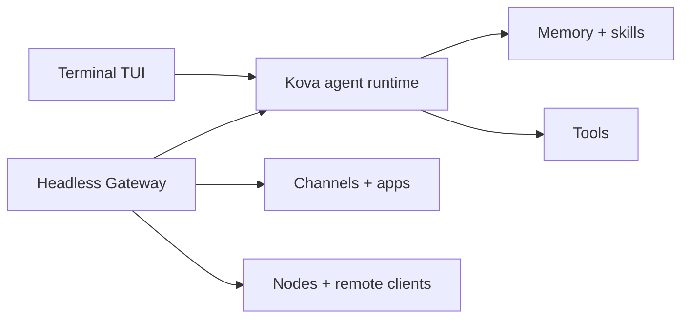

# Kova 🦄

<p align="center">
    
    
</p>

> _"Stay sharp. Ship clearly."_ — Kova

<p align="center">
  <strong>Terminal-first local agent for memory, skills, tools, and durable workflows.</strong><br />
  Start in kova. Add the headless Gateway, channels, apps, and mobile nodes when you want Kova outside the terminal.
</p>

<Columns>
  <Card title="Get Started" href="/start/getting-started" icon="rocket">
    Install Kova and start terminal chat in minutes.
  </Card>
  <Card title="Run Onboarding" href="/start/wizard" icon="sparkles">
    Guided setup with `kova onboard`, model auth, workspace, memory, and skills.
  </Card>
  <Card title="Use The TUI" href="/web/tui" icon="terminal">
    Run `kova` for the local embedded agent experience.
  </Card>
</Columns>

## What is Kova?

Kova is a **terminal-native local agent** with memory, skills, sessions, and tools at the center. You run it from `kova` first, then enable the Gateway when you want always-on delivery, channels, cron, nodes, or apps.

**Who is it for?** Developers and power users who want a personal AI assistant that works locally, remembers durable context, learns reusable procedures, and can still be reached remotely when needed.

**What makes it different?**

- **Terminal-first**: `kova` is the primary interactive product
- **Self-hosted**: runs on your hardware, your rules
- **Learning-oriented**: built around memory, skills, sessions, and reusable workflows
- **Gateway-optional**: one Gateway can serve built-in channels plus bundled or external channel plugins when you enable it
- **Open source**: MIT licensed, community-driven

**What do you need?** Node 24 (recommended), or Node 22 LTS (`22.14+`) for compatibility, an API key from your chosen provider, and 5 minutes. For best quality and security, use the strongest latest-generation model available.

## How it works



The terminal owns the primary agent loop. The Gateway extends that loop to remote clients, channels, scheduled work, and app nodes.

## Key capabilities

<Columns>
  <Card title="Terminal chat" icon="terminal" href="/web/tui">
    Local embedded agent runtime with model, session, tool, and config controls.
  </Card>
  <Card title="Memory and skills" icon="brain" href="/concepts/memory">
    Durable memory, semantic recall, dreaming, and reusable workspace skills.
  </Card>
  <Card title="Plugin channels" icon="plug" href="/tools/plugin">
    Add chat platforms through bundled or external plugins when you need remote reach.
  </Card>
  <Card title="Multi-agent routing" icon="route" href="/concepts/multi-agent">
    Isolated sessions per agent, workspace, or sender.
  </Card>
  <Card title="Media support" icon="image" href="/nodes/images">
    Send and receive images, audio, and documents.
  </Card>
  <Card title="Gateway operations" icon="server" href="/gateway">
    Always-on channels, cron, logs, nodes, remote access, and health checks.
  </Card>
  <Card title="Mobile nodes" icon="smartphone" href="/nodes">
    Pair iOS and Android nodes for Canvas, camera, and voice-enabled workflows.
  </Card>
</Columns>

## Quick start

<Steps>
  <Step title="Install Kova">
    ```bash
    npm install -g getkova@latest
    ```
  </Step>
  <Step title="Onboard and install the service">
    ```bash
    kova onboard --install-daemon
    ```
  </Step>
  <Step title="Chat">
    Start the terminal agent:

    ```bash
    kova
    ```

    Add channels or nodes later when the local agent is working.

  </Step>
</Steps>

Need the full install and dev setup? See [Getting Started](/start/getting-started).

<p align="center">
  
</p>

## Configuration (optional)

Config lives at `~/.kova/kova.json`.

- If you **do nothing**, Kova uses the bundled Pi binary in RPC mode with per-sender sessions.
- If you want to lock it down, start with `channels.whatsapp.allowFrom` and (for groups) mention rules.

Example:

```json5
{
  channels: {
    whatsapp: {
      allowFrom: ["+15555550123"],
      groups: { "*": { requireMention: true } },
    },
  },
  messages: { groupChat: { mentionPatterns: ["@kova"] } },
}
```

## Start here

<Columns>
  <Card title="Docs hubs" href="/start/hubs" icon="book-open">
    All docs and guides, organized by use case.
  </Card>
  <Card title="Configuration" href="/gateway/configuration" icon="settings">
    Core Gateway settings, tokens, and provider config.
  </Card>
  <Card title="Remote access" href="/gateway/remote" icon="globe">
    SSH and tailnet access patterns.
  </Card>
  <Card title="Channels" href="/channels/telegram" icon="message-square">
    Channel-specific setup for Feishu, Microsoft Teams, WhatsApp, Telegram, Discord, and more.
  </Card>
  <Card title="Nodes" href="/nodes" icon="smartphone">
    iOS and Android nodes with pairing, Canvas, camera, and device actions.
  </Card>
  <Card title="Help" href="/help" icon="life-buoy">
    Common fixes and troubleshooting entry point.
  </Card>
</Columns>

## Learn more

<Columns>
  <Card title="Full feature list" href="/concepts/features" icon="list">
    Complete channel, routing, and media capabilities.
  </Card>
  <Card title="Multi-agent routing" href="/concepts/multi-agent" icon="route">
    Workspace isolation and per-agent sessions.
  </Card>
  <Card title="Security" href="/gateway/security" icon="shield">
    Tokens, allowlists, and safety controls.
  </Card>
  <Card title="Troubleshooting" href="/gateway/troubleshooting" icon="wrench">
    Gateway diagnostics and common errors.
  </Card>
  <Card title="About and credits" href="/reference/credits" icon="info">
    Project origins, contributors, and license.
  </Card>
</Columns>
